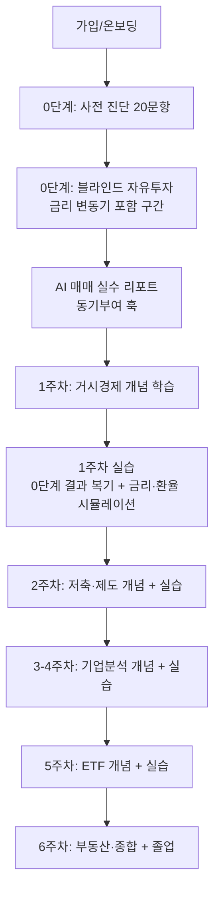

작성일: 2026-07-18 (v2: 2026-07-18 커리큘럼 개편)
기반 문서: 뚝뚝_기획서_초안.docx, 김건우 커리큘럼 개편안(2026-07-18)

# 뚝뚝 — 기본 컨셉과 개요

## 1. 한 줄 정의

아무것도 모른 채 투자를 해보고 참혹한 결과를 겪은 뒤, 그 실패를 교재 삼아 거시경제부터 부동산까지 6주간 실전 자산관리를 배우는 투자 교육 시뮬레이터.

## 2. 핵심 가치와 차별점

기존 모의투자 대회, 토스/카카오페이 교육 콘텐츠, 금감원 e-금융교육센터, 유튜브 금융 콘텐츠는 각각 "거래를 늘릴수록 이득을 보는 구조"이거나 "양은 많지만 재미없어서 스스로 안 찾아보는 콘텐츠"라는 한계가 있다. 뚝뚝은 아래 세 가지로 차별화한다.

| 기능 | 하는 일 | 기존 서비스와 다른 점 |
|---|---|---|
| 무지식 상태의 첫 실패 체험 | 교육 없이 바로 블라인드 투자를 시켜 처참한 결과를 직접 겪게 함 | "배워야 산다"는 동기를 광고가 아니라 유저 자신의 데이터로 만듦 |
| 개념 → 실습 페어링 | 매 주차 개념 학습 직후, 그 개념을 검증하는 미니 시뮬레이션/게임을 반드시 붙임 | 금감원·유튜브형 콘텐츠는 텍스트/영상 소비로 끝나 재미가 없어 이탈함. 뚝뚝은 배운 즉시 써먹게 해서 흡수율을 높임 |
| 자기 실수를 교재로 사용 | 유저 본인의 매매 기록·재무제표 선택 결과를 다음 학습 콘텐츠의 예시로 활용 | 일반 강의 예시보다 자신의 사례일 때 이해도가 높다는 가정에 기반 |

## 3. 커리큘럼 구조 (2026-07-18 개편)

원안(6주, 사전진단→자유투자→하락장→레버리지비교→자기전략→졸업)을 아래처럼 재구성했다. 총 정식 주차 수는 원안과 동일하게 6주를 유지했다(0단계는 정식 주차 카운트에서 제외).

| 단계 | 주제 | 핵심 개념 | 실습/시뮬레이션 | 비고 |
|---|---|---|---|---|
| 0단계 (체험) | 무지식 블라인드 투자 | 없음 — 사전 지식 없이 진행 | 사전 진단 20문항 + 블라인드 자유투자. **이 구간에 뚜렷한 금리 변동기(예: 2022년 긴축기)를 포함**시켜 1주차 거시경제 학습과 서사적으로 연결 | 결과는 AI가 "매매 실수 3가지"로 분석 → 다음 단계 진입 동기 생성 |
| 1주 | 거시경제와 투자의 이유 | 금리-환율-물가의 관계, 투자를 해야 하는 이유, 변동금리 상품, 예적금·대출 시 주의점 | 0단계 결과 복기(금리 구간과 내 손실 겹쳐보기), 금리 인하기 S&P500 리플레이, 금리-채권 가격 상관관계, 한미 금리차와 환율 변동 | MVP 범위 |
| 2주 | 저축과 제도 활용 | 예적금 개념, ISA 계좌, 청년도약계좌 등 정책상품, 절세 | 세전/세후 수익 비교 계산기 | 가계부·소비습관은 제외(뱅크샐러드·토스 영역과 중복, 차별화 어려움) |
| 3-4주 | 좋은 기업 찾기 | 재무제표 기초, PER·PBR 의미, 장기투자가 유리한 이유, 워렌 버핏 가치투자 철학 | 블라인드 재무제표 비교로 저평가 기업 찾기 게임, 장기보유 vs 단타 매매 성과 비교 | CAPEX·애널리스트 리포트 정독법은 심화 옵션(있으면 좋음)으로 분리, MVP 이후 |
| 5주 | ETF와 인덱스 투자 | ETF 구조, 존 보글 인덱스 투자 이론, 퇴직연금(DC/IRP) | 3-4주 개별 종목선정 결과 vs ETF 적립식 투자 성과 비교 | "종목 분석이 어려우면 대안이 있다"는 흐름으로 3-4주 뒤에 배치 |
| 6주 | 부동산과 자산관리 종합 (졸업) | 매매·전세 구조, 주택청약 제도, 나이대별 자산배분 원칙(생애주기 배분은 여기로 통합) | 종합 정리 위주, LTV·DTI 등 세부 시장분석은 제외 | 산출물: 나의 투자 원칙 문서, 사후 진단, 졸업 리포트 |

**변경 근거**: 생애주기 자산배분 비율과 주택청약은 원래 2주차에 있었으나, 아직 주식·ETF·부동산을 배우기 전이라 실감이 나지 않는 시점이었다. 배운 내용을 종합하는 6주차로 옮겨 마무리 흐름과 연결했다. 가계부·소비습관은 이미 잘하는 서비스(뱅크샐러드, 토스)가 있는 영역이라 핵심 커리큘럼에서 제외했다.

## 4. MVP 범위 (개편)

- **MVP**: 0단계(사전 진단 + 블라인드 자유투자 + AI 실수 분석) + 1주차(거시경제 개념 + 실습 3종). 이 슬라이스만으로 핵심 가설("무지식 실패 → 동기부여 → 개념+실습 페어링이 실제로 흡수율을 높이는가")을 검증할 수 있다.
- **Should**: 2주차, 3-4주차
- **Could**: 5주차, 6주차(졸업 구조 포함)

## 5. 핵심 사용자 흐름

## 6. 기술적 접근

- **시뮬레이션 엔진**: 0단계는 원안처럼 자유매매형 블라인드 시뮬레이션이 필요하지만, 1주차 이후 실습은 대부분 특정 구간을 지정한 "가이드형 시나리오 리플레이"로 대체 가능하다(예: 금리 인하기 S&P500 구간만 잘라서 보여주기). 이는 원안의 "10~20년 연속 블라인드 자유매매"보다 필요한 데이터 범위가 작아 데이터 확보 부담이 줄어든다.
- **데이터 소스**: 0단계용 장기 연속 시세 데이터와, 1주차 이후 실습용 특정 구간(금리 인하기, 하락장 등) 시세 데이터로 나눠서 조사하는 것을 추천한다. 후자가 훨씬 조사 범위가 좁다.
- **AI 활용 지점 (축소)**: 커리큘럼이 매매 패턴별 개인화 강의가 아니라 고정된 주차별 커리큘럼으로 바뀌면서, 원안에 있던 "레슨 개인화"·"뉴스 헤드라인 AI 재작성"은 실익이 줄어 제외한다. AI는 **0단계 직후 매매 실수 분석 리포트 한 곳에만 사용**한다. 이 지점은 유저마다 결과가 달라 정적 콘텐츠로 대체할 수 없고, 서비스 초입에 "왜 배워야 하는지"를 설득하는 감정적 훅이라 투자 대비 효과가 크다고 판단했다. 나머지 주차 콘텐츠(개념 설명, 실습 시나리오, 피드백)는 사람이 직접 제작·검수한 정적 콘텐츠로 설계해, 이전에 리스크로 지적했던 "AI 생성 금융 콘텐츠 검수 부담"을 크게 줄인다.

## 7. 확인이 필요한 사항 (팀 결정 필요)

1. **0단계·1주차 실습용 데이터 소스**: 장기 연속 데이터(0단계)와 특정 구간 데이터(1주차 이후)를 어디서 구할지 조사 필요. 범위가 줄었지만 여전히 미확정. (2026-07-18 업데이트: 실제 데이터 확보 전까지는 목업 데이터로 프로토타입을 먼저 만드는 방향으로 진행 — 아래 9번 참고)
2. **금융 콘텐츠 검수**: AI 리포트는 1곳뿐이지만, 나머지 6주 분량의 정적 강의 콘텐츠(거시경제, 재무제표, ETF, 부동산 등)를 누가 작성·검수할지가 새로운 핵심 과제가 됐다. 콘텐츠 작성은 Claude가 담당하고, 최종 검수는 팀 내에서 진행하기로 확정.
3. ~~규제 검토~~ — 학교 토이 프로젝트로 확정되어 유사투자자문업 등록 등 규제 검토는 불필요 (2026-07-18 확정)
4. **개발 리소스/스택**: 플랫폼은 웹사이트로 확정. 구체적 기술 스택(프레임워크 등)은 실제 개발 단계에서 Claude Code가 판단하도록 위임 (2026-07-18 확정)
5. **수익/지속가능성 모델**: 토이 프로젝트이므로 이번 범위에서는 다루지 않음.

## 9. 개발 착수 전 남은 준비 (2026-07-18 추가)

실제 개발(Claude Code)로 넘기기 전, 아직 정의되지 않아 개발이 막힐 수 있는 지점:

- **데이터 모델**: User, 진단 결과, 시뮬레이션 세션, 매매 로그, 레슨 진행도 등의 스키마가 아직 문서화되지 않음
- **0단계·실습2용 목업 데이터셋**: 실제 시세 데이터를 구하기 전까지 프로토타입이 동작하려면 최소한의 목업 시계열 데이터가 필요함
- **빌드 스코프**: 로그인·DB를 포함한 풀스택으로 만들지, 목업 데이터 기반 프론트엔드 프로토타입으로 먼저 만들지 결정 필요

## 8. 다음 문서

- `프로젝트 기획서.md` — 개편된 커리큘럼을 기능 요구사항으로 구체화
- `화면기획서.md` — 개편된 흐름을 화면 단위로 분해
