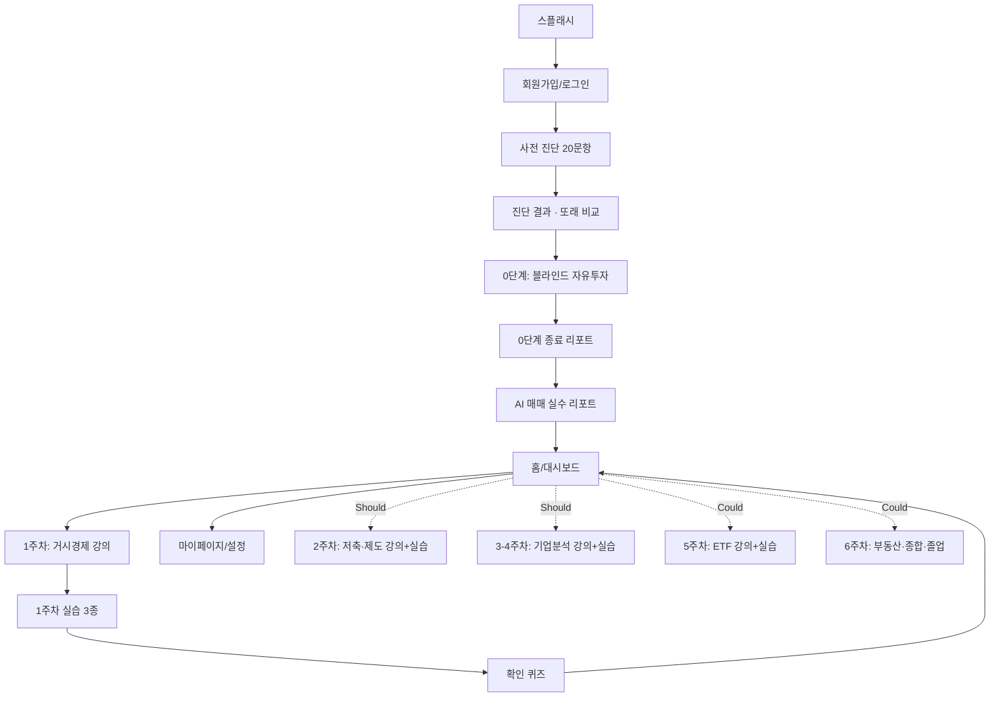

작성일: 2026-07-18 (v2: 2026-07-18 커리큘럼 개편 반영)
관련 문서: [[기본적인 컨셉과 개요.]] · [[프로젝트 기획서]]
범위: MVP(Must = 0단계+1주차) 화면은 상세 스펙, Should/Could 화면은 개요 수준으로 작성. 상세 스펙은 해당 단계 착수 시 별도 보강 필요.

# 화면기획서 — 똑똑

## 1. 전체 IA (사이트맵)

## 2. 화면 목록

| # | 화면명 | 우선순위 | 목적 |
|---|---|---|---|
| 1 | 스플래시/온보딩 | Must | 서비스 소개, 첫 진입 |
| 2 | 회원가입/로그인 | Must | 계정 생성 및 인증 |
| 3 | 사전 진단(20문항) | Must | 현재 금융이해력 측정 |
| 4 | 진단 결과 화면 | Must | 또래 평균 대비 점수 제시, 동기 부여 |
| 5 | 0단계: 블라인드 자유투자 플레이 화면 | Must | 핵심 화면 — 무지식 상태로 매매 진행 |
| 6 | 0단계 종료 리포트 | Must | 수익률/MDD/회전율 및 지수 대비 비교 |
| 7 | AI 매매 실수 리포트 | Must | 손실기여 매매 3건 해설, 서비스 유일의 AI 필수 화면 |
| 8 | 홈/대시보드 | Must | 주차별 진행 상황, 다음 액션 진입점 |
| 9 | 1주차 강의 화면 | Must | 거시경제 개념(금리-환율-물가) 텍스트+이미지 전달 |
| 10 | 1주차 실습 화면 3종 | Must | 0단계 복기, 금리 인하기 S&P500 리플레이, 한미 금리차·환율 실습 |
| 11 | 확인 퀴즈 | Must | 통과해야 다음 주차 진행 |
| 12 | 마이페이지/설정 | Must | 진행 이력, 계정 관리, 알림 설정 |
| 13 | 2주차 강의+실습 (저축·제도) | Should | 예적금/ISA/청년도약계좌 강의, 세전·세후 비교 계산기 |
| 14 | 3-4주차 강의+실습 (기업분석) | Should | 재무제표/PER/PBR/워렌 버핏 강의, 저평가 기업 찾기 게임 |
| 15 | 5주차 강의+실습 (ETF) | Could | 존 보글·퇴직연금 강의, 종목선정 vs ETF 비교 |
| 16 | 6주차 강의+졸업 (부동산·종합) | Could | 부동산·생애주기 배분 강의, 나의 투자 원칙 문서, 졸업 리포트 |

## 3. 화면별 상세 — Must (MVP: 0단계 + 1주차)

### 3-1. 스플래시/온보딩
- **목적**: 서비스 정체성("잃어도 되는 곳에서, 먼저 잃게 한다") 3~4장 카드로 전달
- **구성요소**: 로고, 슬로건, 온보딩 카드, "바로 투자해보기" CTA
- **인터랙션**: 스와이프로 카드 넘김, 스킵 가능
- **예외**: 재방문 유저는 온보딩 생략하고 로그인 화면으로 바로 이동

### 3-2. 회원가입/로그인
- **구성요소**: 이메일/소셜 로그인, 약관 동의(투자 시뮬레이션이며 실제 투자 조언이 아니라는 고지 필수)
- **예외**: 미성년자 가입 처리 정책 — 대학 고학년 타겟 포함되므로 연령 확인 로직 필요 여부 팀 결정 필요

### 3-3. 사전 진단(20문항)
- **목적**: 한국은행 금융이해력 조사 문항 기반 20문항 응시
- **구성요소**: 진행률 표시(N/20), 객관식 문항, 이전/다음 이동
- **인터랙션**: 중도 이탈 시 임시 저장 후 재진입 지원 필요
- **예외**: 전체 미응시 시 0단계 진입 제한할지 여부 — 정책 미정, 팀 확인 필요

### 3-4. 진단 결과 화면
- **구성요소**: 내 점수, 또래 평균(20대 62.6점) 비교 막대그래프, "이제 투자를 직접 해보세요" CTA
- **인터랙션**: CTA 클릭 시 0단계 진입

### 3-5. 0단계: 블라인드 자유투자 플레이 화면 (핵심 화면)

| 구성요소 | 설명 |
|---|---|
| 종목 리스트 패널 | 익명화된 종목(A전자, B바이오 등) 목록, 현재가·등락률 |
| 차트 영역 | 선택 종목의 시세 흐름, 시간 압축 상태 표시 |
| 매수/매도 패널 | 수량/금액 입력, 수수료·세금 자동 계산 후 체결가 표시 |
| 시간 컨트롤 | 빨리감기/일시정지, 장 마감 단위 진행 |
| 자산 현황 | 보유 현금, 평가금액, 누적 수익률 |

- **필수 데이터 조건**: 시뮬레이션 구간에 뚜렷한 금리 변동기(예: 2022년 긴축기)를 반드시 포함 — 1주차 거시경제 학습과의 연결고리이므로 데이터 구간 선정 시 임의로 정하면 안 됨
- **인터랙션 우선순위**: 매수/매도 → 시간 진행 → 종목 조회. 교육 없이 바로 매매를 시켜야 하므로 온보딩 설명은 최소화(유저가 "모른 채" 시작하는 게 설계 의도)
- **예외**: 파산(잔고 0 이하) 시 처리 로직 — 상장폐지 종목 포함 여부는 데이터 확보 범위에 달림
- **성능 요구**: 시세 데이터 프리로드 방식 검토 필요

### 3-6. 0단계 종료 리포트
- **구성요소**: 최종 수익률, 매매 횟수, 수수료 총액, MDD, "동일 자금 지수 ETF 적립 매수 시" 비교선 그래프
- **인터랙션**: "내 실수 보기" CTA로 AI 리포트 화면 진입
- **표시 데이터**: 세션 중 발생한 전체 매매 로그(AI 분석의 입력 데이터)

### 3-7. AI 매매 실수 리포트
- **목적**: 손실 기여도가 큰 의사결정 3건을 AI가 추출해 자연어로 설명, 다음 학습 동기 부여
- **구성요소**: 매매 시점 3건 카드(당시 상황 + 결과 + 해설), "왜 이런 실수를 했는지 알아보기 (1주차 시작)" CTA
- **예외/리스크**: AI 생성 문구의 사실 정확성 검수 프로세스 필요([[프로젝트 기획서]] 7번 항목 참고). 서비스 내 유일한 AI 필수 화면이므로 검수 리소스를 여기에 집중
- **톤 주의**: "처참한 결과"를 보여주되 자기비하로 흐르지 않도록 문구 검토 필요(유저 웰빙 고려)

### 3-8. 홈/대시보드
- **구성요소**: 현재 주차 진행 상태, 다음 액션 카드(강의/실습/퀴즈), 진단 점수 추이 요약
- **인터랙션**: 주차별 잠금 해제 방식(이전 퀴즈 통과 전 다음 주차 비활성화)

### 3-9. 1주차 강의 화면
- **목적**: 금리-환율-물가의 관계, 투자를 해야 하는 이유, 변동금리 상품, 예적금·대출 시 주의점을 텍스트+이미지로 전달
- **구성요소**: 섹션별 카드형 콘텐츠(개념 1개당 1~2장), 인포그래픽/도식 이미지, "0단계 내 결과와 연결해서 보기" 인용 블록(내 매매 시점에 실제 금리가 어떻게 움직였는지 오버레이)
- **콘텐츠 소스**: AI 생성이 아닌 사람이 작성 — 검수 부담을 줄이기 위한 설계 결정([[기본적인 컨셉과 개요.]] 6번 참고)

### 3-10. 1주차 실습 화면 3종
| 실습 | 구성요소 |
|---|---|
| 0단계 결과 복기 | 내 매매 타임라인 위에 금리 인상/인하 구간을 오버레이한 차트, "이 시점에 금리가 올랐다는 걸 알았다면?" 질문형 인터랙션 |
| 금리 인하기 S&P500 가이드 리플레이 | 특정 구간만 잘라 재생, 유저는 관찰 후 간단한 선택형 질문에 답함(자유매매 아님, 가이드형) |
| 한미 금리차·환율 실습 | 금리차 슬라이더를 움직이면 환율 변동 방향을 예측해보는 인터랙티브 위젯 |

- **설계 원칙**: 세 실습 모두 자유매매형 엔진이 아니라 가이드형 시나리오로 구현 가능 — 0단계보다 데이터/엔진 부담이 작음

### 3-11. 확인 퀴즈
- **구성요소**: 1주차 개념 기반 객관식 문항, 오답 시 관련 강의 섹션으로 되돌아가는 링크
- **인터랙션**: 통과해야 다음 주차(2주차) 잠금 해제

### 3-12. 마이페이지/설정
- **구성요소**: 주차별 진행 이력, 진단 점수 추이, 계정 정보, 알림 설정, 로그아웃

## 4. 화면별 개요 — Should / Could (2단계 이후)

| 화면 | 우선순위 | 핵심 요소만 기재 |
|---|---|---|
| 2주차 강의+실습 | Should | 예적금/ISA/청년도약계좌 강의, 세전·세후 수익 비교 계산기(입력형 위젯) |
| 3-4주차 강의+실습 | Should | 재무제표 기초 3표 강의, PER·PBR 설명, 블라인드 재무제표로 저평가 기업 찾기 게임(카드 매칭형 UI), 장기 vs 단타 성과 비교 그래프 |
| 5주차 강의+실습 | Could | ETF 구조·존 보글·퇴직연금 강의, 3-4주차 종목선정 결과 vs ETF 적립식 결과 나란히 비교하는 화면 |
| 6주차 강의+졸업 | Could | 부동산(매매/전세/청약) + 생애주기 자산배분 종합 강의, 나의 투자 원칙 입력 폼, 사전·사후 진단 비교, 졸업 리포트, 멘토 신청 CTA |

이 4개 묶음은 Must 화면(0단계+1주차)이 실제로 동작한 뒤 상세 설계하는 것을 제안한다. 특히 3-4주차의 "저평가 기업 찾기 게임" UI는 별도 프로토타입 검증이 필요한 수준의 복잡도다.

## 5. 미정 사항 (화면 설계 관점에서 추가로 확인 필요)

1. ~~플랫폼: 모바일 웹앱 vs 네이티브 앱~~ — 웹사이트로 확정 (2026-07-18)
2. 0단계 플레이 화면의 차트 라이브러리/성능 요구사항 — Claude Code 구현 단계에서 판단
3. ~~사전 진단 20문항의 실제 문항 리스트~~ — 작성 완료, 자체 재구성 (`콘텐츠/사전진단_20문항.md`)
4. ~~1주차 강의 콘텐츠의 실제 텍스트·이미지 원고~~ — 작성 완료 (`콘텐츠/1주차_거시경제와_투자의_이유.md`)
